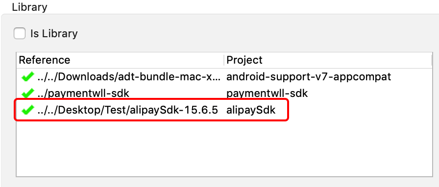
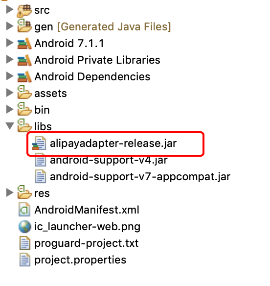

# Alipay integration instruction

## Integrate Alipay plugin

## Step 1
### Android Studio

#### Migrating form the old JAR SDK to the AAR SDK
The Alipay SDK starts with 15.5.7, and the packaging method is replaced with AAR. Instead of the previous JAR package, the SDK payment interface part remains unchanged.

If you have imported Alipay SDK with `alipaySdk-xxx.jar`, please follow the steps below to remove the old JAR configuration:

1. In the `build.gradle` of `app` module, removing Alipay SDK JAR package. Sample code as follows:

```gradle
dependencies {
    ... ...
    compile files('libs/alipaySdk-20170725.jar')
    ... ... 
}
```

2. From the `libs` folder, delete `alipaySdk-xxx.jar` such as:

 

3. From `AndroidManifest.xml`, remove the registered Alipay Activity (no need to register with AAR):

```java
<activity
    android:name="com.alipay.sdk.app.H5PayActivity"
    android:configChanges="orientation|keyboardHidden|navigation"
    android:exported="false"
    android:screenOrientation="behind" />

<activity
    android:name="com.alipay.sdk.auth.AuthActivity"
    android:configChanges="orientation|keyboardHidden|navigation"
    android:exported="false"
    android:screenOrientation="behind" />
```

Then:

* Download sdk as compiled ".aar" files: [Alipay SDK](../AndroidStudio/alipaySdk-15.6.5-20190718211148.aar) and [Alipay Adapter](../AndroidStudio/alipayadapter-release.aar)
* Open your project > File > New > New Module
* Click Import .JAR/.AAR Package then click Next
* Enter the location of the compiled AAR files then click Finish

### Eclipse

1. Download and extract [alipaySdk-15.6.5.zip](../Eclipse/alipaySdk-15.6.5.zip)

2. Import the project into your workspace. And add this as your main project's library.



3. Copy alipayadapter-release jar files to 'libs' folder in the project directory




## Step 2
### Android Studio
Import alipayadapter-release.aar as a module into your project. After that, add this line to your app module's build.gradle file:
```java
compile project(':alipaySdk-15.6.5-20190718211148')
compile project(':alipayadapter-release')
```

## Step 3
Initialize an instance of PsAlipay object (after UnifiedRequest object initialization)
```java
UnifiedRequest request = new UnifiedRequest();
request.setPwProjectKey(Constants.PW_PROJECT_KEY);
request.setPwSecretKey(Constants.PW_SECRET_KEY);
...

PsAlipay alipay = new PsAlipay();
```
With domestic account, those attributes must be set:
```java
alipay.setAppId(Constants.ALIPAY.APP_ID);
alipay.setPaymentType("1");
```
And with international account:
```java
alipay.setAppId(Constants.ALIPAY.APP_ID);
alipay.setPaymentType("1");
alipay.setItbPay("30m");
alipay.setForexBiz("FP");
alipay.setAppenv("system=android^version=3.0.1.2");
```
If Paymentwall secret key is not presented, you have to generate signature for digital goods api by yourself and set it to PsAlipay object:
```java
alipay.setPwSign(genPwSignature());
```

Signature generation instruction can be referred [here](https://paymentwall.github.io/signature-calculation).


## Step 4
Create an instance of ExternalPs with the above PsAlipay object
```java
ExternalPs alipayPs = new ExternalPs("alipay", "Alipay", R.drawable.ps_logo_alipay, alipay);
```
Add this to the unified request object:
```java
request.add(alipayPs);
```
