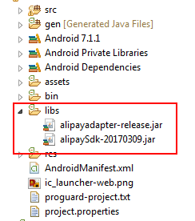

# Alipay integration instruction

## Step 1
### Android Studio
Copy alipay sdk jar file to 'libs' folder in the app directory.

 
### Eclipse
Copy alipaysdk and alipayadapter-release jar files to 'libs' folder in the project directory

 


## Step 2
### Android Studio
Import alipayadapter-release.aar as a module into your project. After that, add this line to your app module's build.gradle file:
```java
compile project(':alipayadapter-release')
```
      
## Step 3
Declare these activities in your AndroidManifest file:
```java
<activity
   android:name="com.alipay.sdk.app.H5PayActivity"
   android:configChanges="orientation|keyboardHidden|navigation"
   android:exported="false"
   android:screenOrientation="behind" />

<activity
   android:name="com.alipay.sdk.auth.AuthActivity"
   android:configChanges="orientation|keyboardHidden|navigation"
   android:exported="false"
   android:screenOrientation="behind" />
```

## Step 4
Initialize an instance of PsAlipay object (after UnifiedRequest object initialization)
```java
UnifiedRequest request = new UnifiedRequest();
request.setPwProjectKey(Constants.PW_PROJECT_KEY);
request.setPwSecretKey(Constants.PW_SECRET_KEY);
...

PsAlipay alipay = new PsAlipay();
```
With domestic account, those attributes must be set:
```java
alipay.setAppId(Constants.ALIPAY.APP_ID);
alipay.setPaymentType("1");
```
And with international account:
```java
alipay.setAppId(Constants.ALIPAY.APP_ID);
alipay.setPaymentType("1");
alipay.setItbPay("30m");
alipay.setForexBiz("FP");
alipay.setAppenv("system=android^version=3.0.1.2");
```
If Paymentwall secret key is not presented, you have to generate signature for digital goods api by yourself and set it to PsAlipay object:
```java
alipay.setPwSign(genPwSignature());
```

Signature generation instruction can be referred here.


## Step 5
Create an instance of ExternalPs with the above PsAlipay object
```java
ExternalPs alipayPs = new ExternalPs("alipay", "Alipay", R.drawable.ps_logo_alipay, alipay);
```
Add this to the unified request object:
```java
request.add(alipayPs);
```
