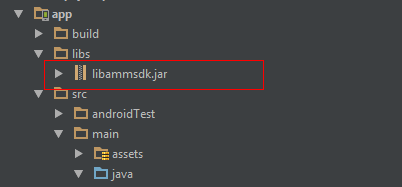

# Wechatpay integration instruction

## Step 1
Copy library jar files to ‘libs’ folder in the app directory.

 

## Step 2
Add this line to your app module’s build.gradle file:
```java
compile project(':wechatpayadapter-release')
```
      
## Step 3
Initialize an instance of PsWechat object (after UnifiedRequest object initialization)
```java
UnifiedRequest request = new UnifiedRequest();
request.setPwProjectKey(Constants.PW_PROJECT_KEY);
request.setPwSecretKey(Constants.PW_SECRET_KEY);
...

PsWechat wechat = new PsWechat();
wechat.setTradeType("APP");
```

## Step 4
Create an instance of ExternalPs with the above PsWechat object
```java
ExternalPs wechatPs = new ExternalPs("wechat", "Wechatpay", R.drawable.ps_logo_wechat_pay, wechat);
```
Add this to the unified request object:
```java
request.add(wechatPs);
```
